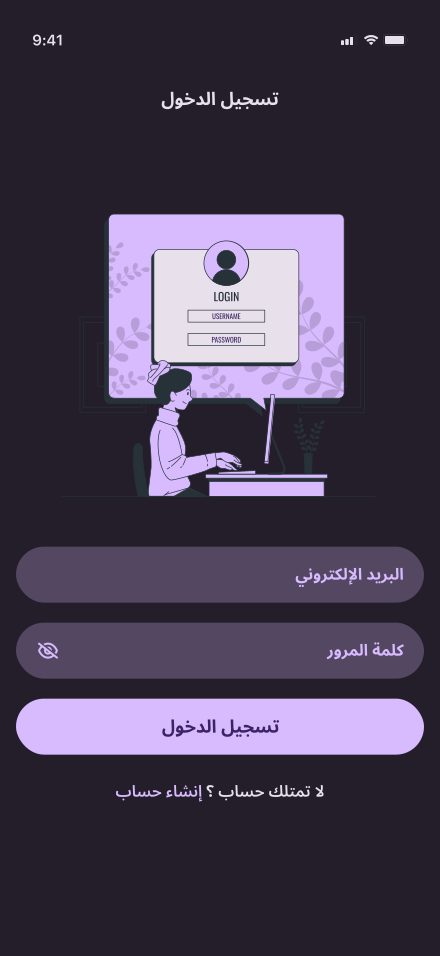
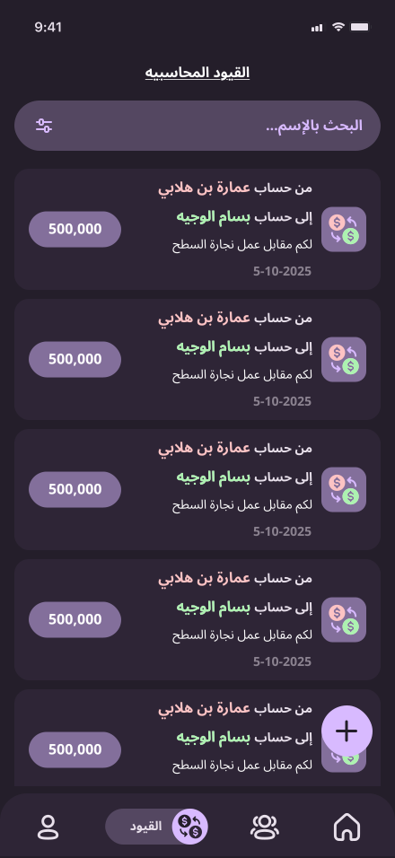
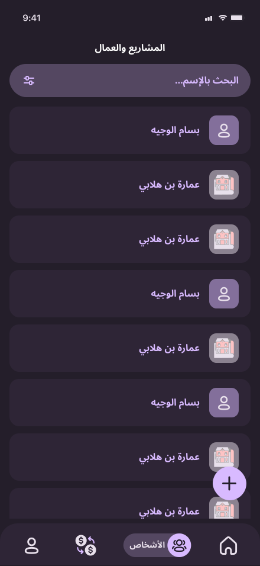
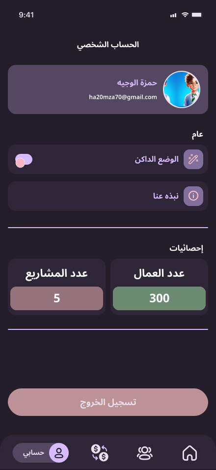
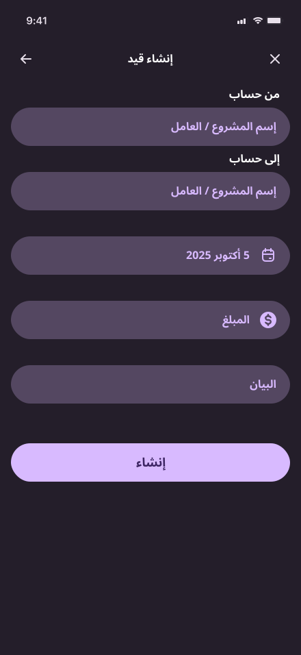
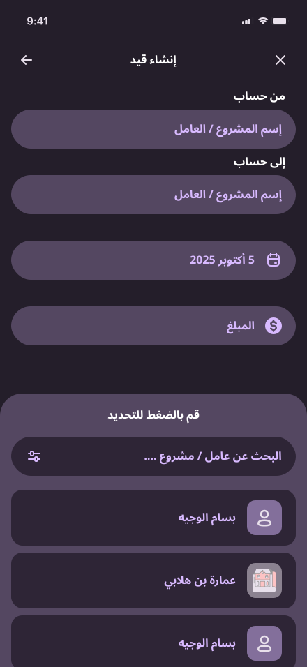

# Daily Cash — إدارة النقد اليومي

تطبيق Flutter لإدارة العمليات المالية اليومية (إيرادات ومصاريف)، يتوافق مع احتياجات المشاريع الصغيرة وأصحاب العمال. يوفّر واجهة لإضافة وتعديل وحذف العمليات، إدارة الأشخاص/المشاريع، عرض تقارير وملفات PDF، وقوائم ملخّصة لإجمالي الإيرادات والمصاريف.

**الهدف:** تمكين المستخدم من تتبُّع العمليات المالية اليومية بسهولة وسرعة، والحصول على تقارير وتصدير بيانات مفيدة.

## الميزات الرئيسية

- إضافة عملية (إيراد/منصرف) مع تاريخ، مبلغ، جهة/عامل، وبيان.

# Daily Cash — إدارة النقد اليومي

تطبيق Flutter لإدارة العمليات المالية اليومية (إيرادات ومصاريف)، يتوافق مع احتياجات المشاريع الصغيرة وأصحاب العمال. يوفّر واجهة لإضافة وتعديل وحذف العمليات، إدارة الأشخاص/المشاريع، عرض تقارير وملفات PDF، وقوائم ملخّصة لإجمالي الإيرادات والمصاريف.

**الهدف:** تمكين المستخدم من تتبُّع العمليات المالية اليومية بسهولة وسرعة، والحصول على تقارير وتصدير بيانات مفيدة.

## الميزات الرئيسية

- إضافة عملية (إيراد/منصرف) مع تاريخ، مبلغ، جهة/عامل، وبيان.
- تعديل وحذف العمليات القائمة.
- إدارة الأشخاص (إضافة، حذف، عرض التفاصيل، تحميل PDF).
- عرض ملخّص اليوم، وإجمالي الصناديق النقدية.
- قوائم العمليات الحديثة والبحث داخلها.
- دعم تصدير/عرض تقارير PDF عبر رابط مُحمَّل.

## التقنيات والمكتبات المستخدمة

- Flutter & Dart
- State management: `flutter_bloc` (Cubit)
- Dependency injection / service locator: `get_it`
- HTTP client: `dio`
- Functional error handling: `dartz` (Either)
- Local preferences: مكوّن مشاركة تفضيلات (singleton)
- UI helpers: `flutter_svg`, `flutter_slidable`, `flutter_cached_pdfview`, `intl`

## بنية المشروع والـArchitecture

البنية متبعة نهج عملي يجمع بين مبادئ MVVM (مستوحاة) ونمط Repository، مع فصل واضح للمسؤوليات:

- Presentation (واجهة العرض)

  - `lib/Features/*/presentation/views/` : صفحات العرض (`View`) ومكوّنات الواجهة (`widgets`).
  - `Cubit`/Controllers: تُستخدم كمستوى `ViewModel` لإدارة حالة كل شاشة (مثل `EditOperationCubit`, `GetAllOperationsCubit`). هذه الـCubits موجودة في مجلد `controller` لكل ميزة.

- Data (المصدر)

  - `lib/Features/*/data/repos/*` : واجهات الـRepository و`Impl` التي تتعامل مع `ApiService` لطلبات الشبكة.
  - `ApiService` (في `core/services`) يجريّ كل طلبات `GET/POST/PUT/DELETE` باستخدام Dio.

- Core
  - أدوات مشتركة، وواجهات الخطأ، ومكوّنات واجهة عامة، وخدمة تحديد المواقع `service_locator` وملف التهيئة `main.dart`.

النمط المستخدم: Repository Pattern

- سبب الاختيار: فصل منطق الوصول إلى البيانات (HTTP) عن منطق العرض، ما يسهل الاختبار، إعادة الاستخدام، وتبديل المصدر (مثلاً: من API إلى mock أو قاعدة بيانات محلية).

State Management: Cubit (جزء من BLoC)

- سبب الاختيار: Cubit خفيف وبسيط عندما لا تحتاج إلى معالجة أحداث معقّدة، ويمنح تحكماً واضحاً بحالة الشاشة مع إمكانيات الاستماع (`BlocBuilder`, `BlocConsumer`).

لماذا MVVM-like؟

- في هذه الشيفرة، الـ`Cubit` يعمل كـViewModel حيث يعالج منطق واجهة المستخدم وحالة الشاشة، بينما تبقى الواجهات مرنة وخالية من منطق التواصل مع الـAPI.

## هيكل المجلدات (مختصر)

- `lib/main.dart` — نقطة البداية وتهيئة `GetIt` وBlocProviders العامة.
- `lib/core/` — خدمات مشتركة (`api_service.dart`, `service_locator.dart`, widgets عامة، أنماط الألوان والخطوط).
- `lib/Features/` — كل ميزة منظمة بمجلد فرعي يحتوي على `data/`, `presentation/` (views, widgets, controllers).

## سبب اختيار المكتبات والأدوات

- `flutter_bloc` (Cubit): فصل الحالة عن العرض ويسهّل الاختبار.
- `get_it`: حقن تبعيات بسيط وفعّال دون الحاجة إلى boilerplate زائد.
- `dio`: مكتبة HTTP قوية مع إمكانيات التعامل مع الأخطاء والـinterceptors.
- `dartz` (Either): نمط برمجي وظيفي لمعالجة الأخطاء بدل الاستثناءات المباشرة.

## كيفية التشغيل محليًا

1. تأكد من تثبيت Flutter وSDK الملائم.
2. جلب الحزم:

```powershell
flutter pub get
```

3. تشغيل التطبيق على المحاكي أو الجهاز:

```powershell
flutter run
```

4. تحليل الشيفرة وإصلاح التنسيق:

```powershell
flutter analyze
dart format .
```

## لقطات الشاشة

<div style="display:grid;grid-template-columns:repeat(2,minmax(0,1fr));gap:12px;align-items:start">
  <div style="max-width:420px;padding:6px;background:#fff;border:1px solid #eee;box-shadow:0 1px 4px rgba(0,0,0,0.04)">
    
  </div>
  <div style="max-width:420px;padding:6px;background:#fff;border:1px solid #eee;box-shadow:0 1px 4px rgba(0,0,0,0.04)">
    
  </div>
  <div style="max-width:420px;padding:6px;background:#fff;border:1px solid #eee;box-shadow:0 1px 4px rgba(0,0,0,0.04)">
    
  </div>
  <div style="max-width:420px;padding:6px;background:#fff;border:1px solid #eee;box-shadow:0 1px 4px rgba(0,0,0,0.04)">
    
  </div>
  <div style="max-width:420px;padding:6px;background:#fff;border:1px solid #eee;box-shadow:0 1px 4px rgba(0,0,0,0.04)">
    
  </div>
  <div style="max-width:420px;padding:6px;background:#fff;border:1px solid #eee;box-shadow:0 1px 4px rgba(0,0,0,0.04)">
    
  </div>
  <div style="max-width:420px;padding:6px;background:#fff;border:1px solid #eee;box-shadow:0 1px 4px rgba(0,0,0,0.04)">
    
  </div>
  <div style="max-width:420px;padding:6px;background:#fff;border:1px solid #eee;box-shadow:0 1px 4px rgba(0,0,0,0.04)">
    
  </div>
  <div style="max-width:420px;padding:6px;background:#fff;border:1px solid #eee;box-shadow:0 1px 4px rgba(0,0,0,0.04)">
    
  </div>
  <div style="max-width:420px;padding:6px;background:#fff;border:1px solid #eee;box-shadow:0 1px 4px rgba(0,0,0,0.04)">
    
  </div>
  <div style="max-width:420px;padding:6px;background:#fff;border:1px solid #eee;box-shadow:0 1px 4px rgba(0,0,0,0.04)">
    
  </div>
  <div style="max-width:420px;padding:6px;background:#fff;border:1px solid #eee;box-shadow:0 1px 4px rgba(0,0,0,0.04)">
    
  </div>
  <div style="max-width:420px;padding:6px;background:#fff;border:1px solid #eee;box-shadow:0 1px 4px rgba(0,0,0,0.04)">
    
  </div>
  <div style="max-width:420px;padding:6px;background:#fff;border:1px solid #eee;box-shadow:0 1px 4px rgba(0,0,0,0.04)">
    
  </div>
  <div style="max-width:420px;padding:6px;background:#fff;border:1px solid #eee;box-shadow:0 1px 4px rgba(0,0,0,0.04)">
    
  </div>
  <div style="max-width:420px;padding:6px;background:#fff;border:1px solid #eee;box-shadow:0 1px 4px rgba(0,0,0,0.04)">
    
  </div>
</div>
